# 手机维修系统 - 业务流程与数据流设计

**作者：** MiniMax Agent  
**日期：** 2025-07-17

## 核心业务流程设计

### 1. 完整订单生命周期流程

#### 1.1 订单创建阶段
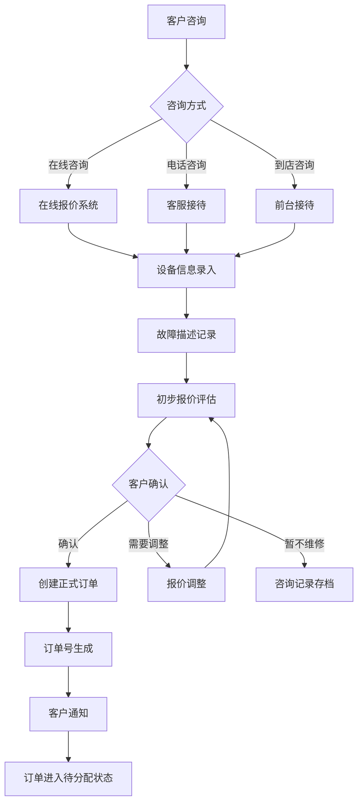

#### 1.2 订单分配与执行阶段
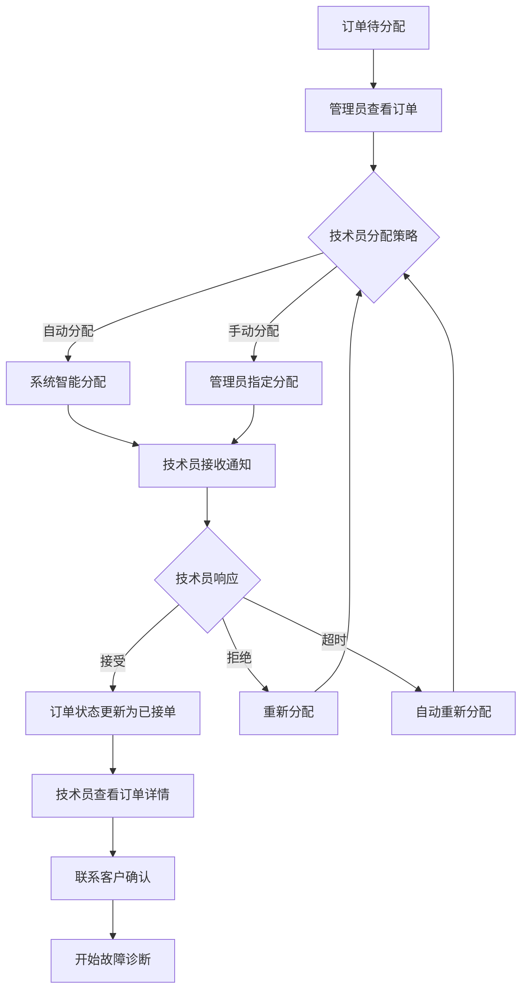

#### 1.3 维修执行阶段
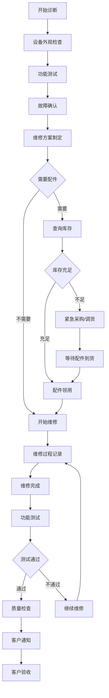

#### 1.4 订单完成阶段
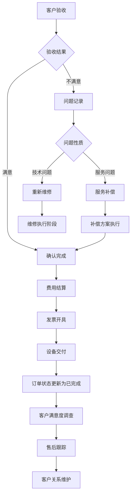

### 2. 库存管理业务流程

#### 2.1 库存监控与预警流程
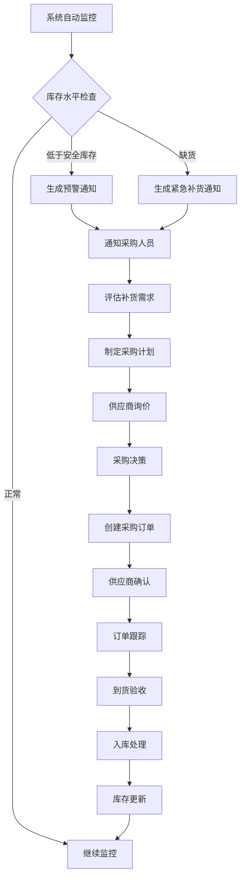

#### 2.2 配件申请与分发流程
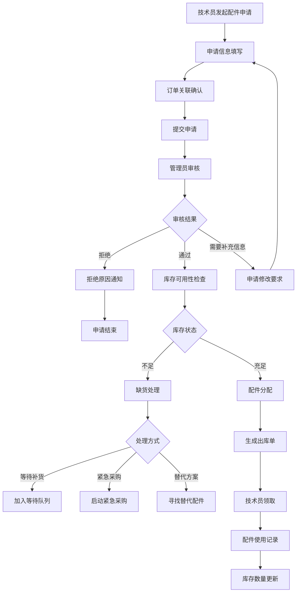

### 3. 客户服务业务流程

#### 3.1 客户咨询处理流程
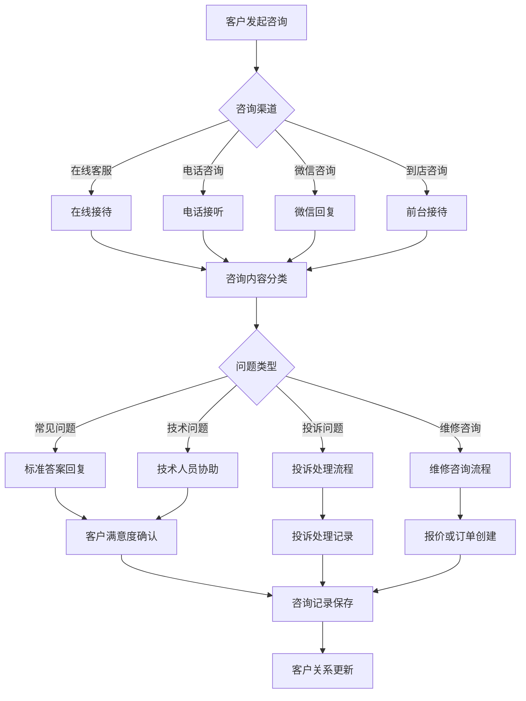

#### 3.2 客户投诉处理流程
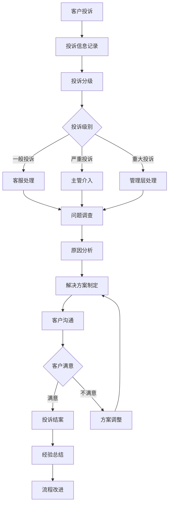

## 数据流设计

### 1. 实时数据同步架构

#### 1.1 数据同步流向图
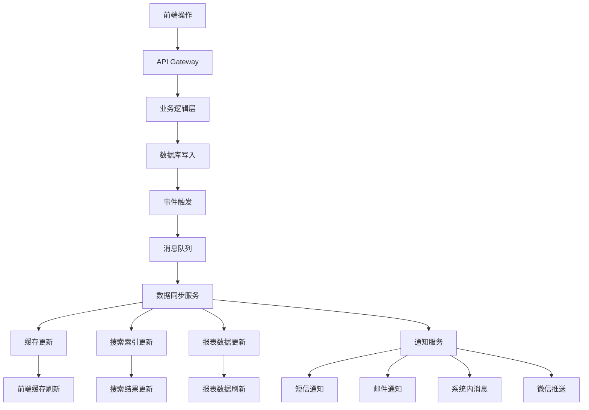

#### 1.2 订单状态数据流
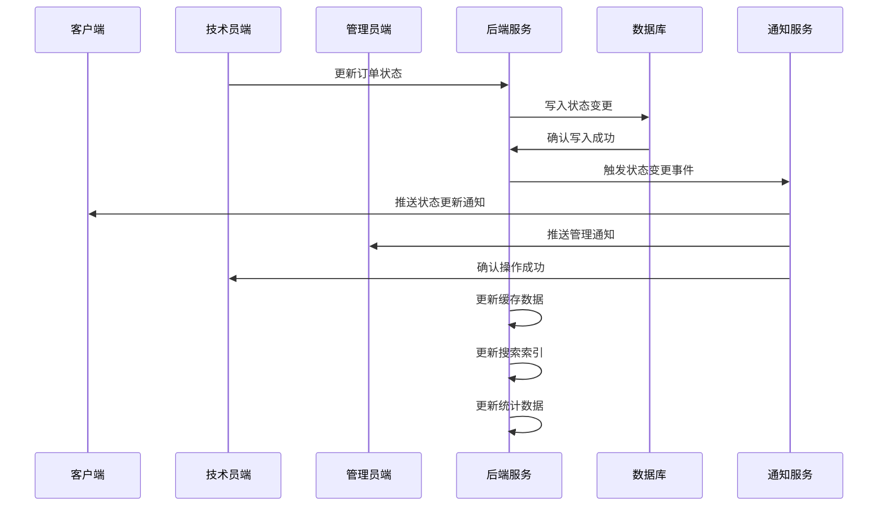

#### 1.3 库存数据流
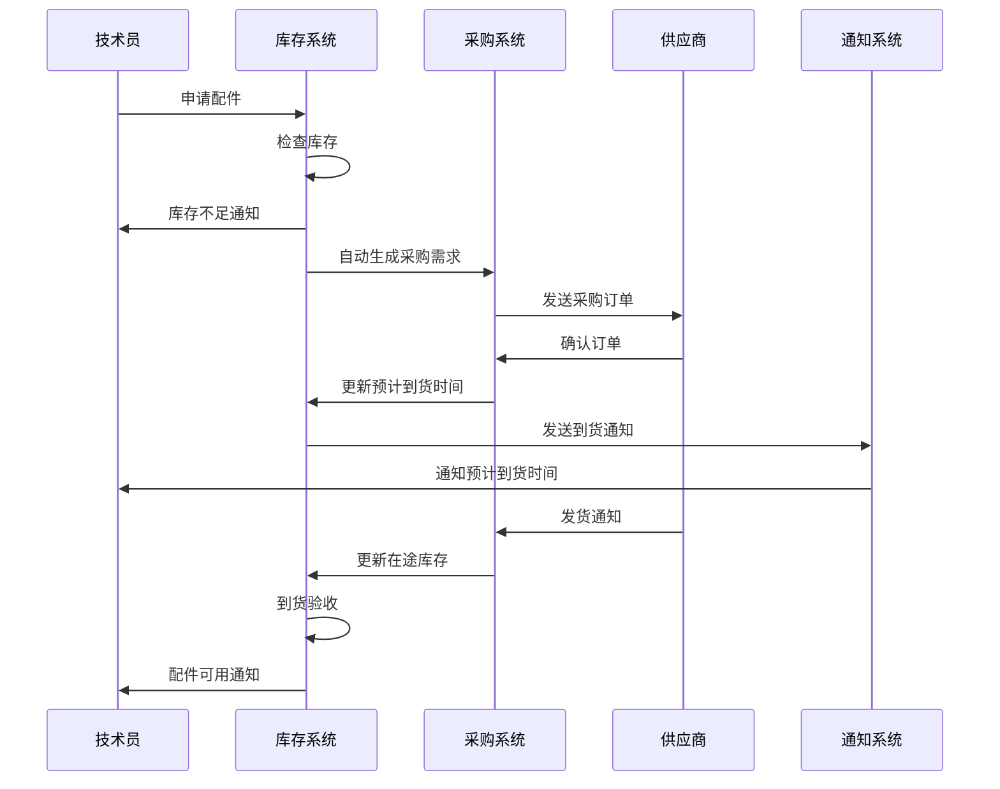

### 2. 数据一致性保证机制

#### 2.1 事务处理机制
```typescript
// 订单创建事务示例
async function createOrder(orderData) {
  const transaction = await db.beginTransaction();
  
  try {
    // 1. 创建订单记录
    const order = await db.orders.create(orderData, { transaction });
    
    // 2. 创建客户记录（如果不存在）
    await db.customers.upsert(orderData.customer, { transaction });
    
    // 3. 创建订单状态历史
    await db.orderStatusHistory.create({
      orderId: order.id,
      status: 'PENDING',
      notes: '订单创建',
      createdBy: orderData.createdBy
    }, { transaction });
    
    // 4. 更新客户统计信息
    await db.customers.increment('orderCount', {
      where: { id: orderData.customerId },
      transaction
    });
    
    // 5. 提交事务
    await transaction.commit();
    
    // 6. 触发后续事件
    await eventBus.emit('order.created', order);
    
    return order;
  } catch (error) {
    // 回滚事务
    await transaction.rollback();
    throw error;
  }
}
```

#### 2.2 数据校验机制
```typescript
// 多层数据校验
class OrderValidator {
  // 前端校验
  static validateClientSide(data) {
    return z.object({
      customerName: z.string().min(2),
      phone: z.string().regex(/^1[3-9]\d{9}$/),
      deviceModel: z.string().min(1),
      issueDescription: z.string().min(10)
    }).parse(data);
  }
  
  // API层校验
  static validateApiLayer(data) {
    // 业务规则校验
    if (data.estimatedCost < 0) {
      throw new Error('费用不能为负数');
    }
    
    // 重复订单检查
    const duplicateOrder = await this.checkDuplicateOrder(data);
    if (duplicateOrder) {
      throw new Error('存在重复订单');
    }
  }
  
  // 数据库层校验
  static validateDatabaseLayer(data) {
    // 外键约束校验
    // 数据格式校验
    // 业务规则校验
  }
}
```

### 3. 缓存策略设计

#### 3.1 多级缓存架构
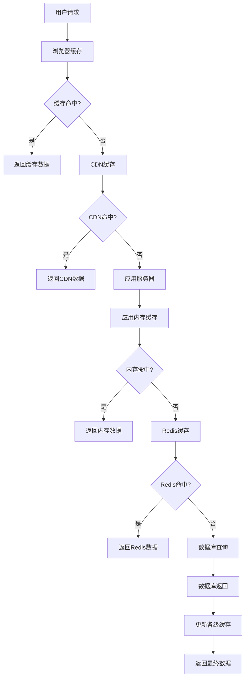

#### 3.2 缓存更新策略
```typescript
// 智能缓存更新
class CacheManager {
  // 订单相关缓存更新
  async updateOrderCache(orderId, updateData) {
    // 1. 删除相关缓存
    await this.invalidateCache([
      `order:${orderId}`,
      `orders:technician:${updateData.technicianId}`,
      `orders:customer:${updateData.customerId}`,
      'orders:statistics',
      'dashboard:overview'
    ]);
    
    // 2. 预热关键缓存
    await this.preloadCache([
      `order:${orderId}`,
      'orders:active',
      'dashboard:overview'
    ]);
  }
  
  // 库存相关缓存更新
  async updateInventoryCache(partId, quantity) {
    await this.invalidateCache([
      `inventory:${partId}`,
      'inventory:low-stock',
      'dashboard:inventory'
    ]);
    
    // 如果库存低于警戒线，立即更新相关缓存
    if (quantity < LOW_STOCK_THRESHOLD) {
      await this.preloadCache(['inventory:low-stock']);
    }
  }
}
```

## API接口设计

### 1. RESTful API 设计规范

#### 1.1 订单管理API
```typescript
// 订单相关API端点
interface OrderAPI {
  // 获取订单列表
  'GET /api/orders': {
    query: {
      status?: OrderStatus;
      technicianId?: string;
      customerId?: string;
      dateFrom?: string;
      dateTo?: string;
      page?: number;
      limit?: number;
    };
    response: PaginatedResponse<OrderWithRelations>;
  };
  
  // 创建新订单
  'POST /api/orders': {
    body: CreateOrderRequest;
    response: OrderResponse;
  };
  
  // 获取订单详情
  'GET /api/orders/:id': {
    params: { id: string };
    response: OrderDetailResponse;
  };
  
  // 更新订单状态
  'PATCH /api/orders/:id/status': {
    params: { id: string };
    body: { status: OrderStatus; notes?: string };
    response: OrderResponse;
  };
  
  // 分配技术员
  'POST /api/orders/:id/assign': {
    params: { id: string };
    body: { technicianId: string };
    response: OrderResponse;
  };
}
```

#### 1.2 库存管理API
```typescript
interface InventoryAPI {
  // 获取库存列表
  'GET /api/inventory': {
    query: {
      category?: string;
      lowStock?: boolean;
      search?: string;
      page?: number;
      limit?: number;
    };
    response: PaginatedResponse<InventoryItem>;
  };
  
  // 配件申请
  'POST /api/inventory/requests': {
    body: {
      orderId: string;
      items: Array<{
        partId: string;
        quantity: number;
        urgency: 'normal' | 'urgent';
      }>;
      notes?: string;
    };
    response: InventoryRequestResponse;
  };
  
  // 配件出库
  'POST /api/inventory/:id/checkout': {
    params: { id: string };
    body: {
      quantity: number;
      orderId: string;
      technicianId: string;
    };
    response: InventoryResponse;
  };
}
```

### 2. WebSocket 实时通信

#### 2.1 实时消息推送
```typescript
// WebSocket 事件定义
interface WebSocketEvents {
  // 订单状态更新
  'order.status.updated': {
    orderId: string;
    newStatus: OrderStatus;
    oldStatus: OrderStatus;
    technicianId?: string;
    customerId: string;
    timestamp: Date;
  };
  
  // 新订单分配
  'order.assigned': {
    orderId: string;
    technicianId: string;
    orderInfo: OrderBasicInfo;
    assignedBy: string;
    timestamp: Date;
  };
  
  // 库存预警
  'inventory.low.stock': {
    partId: string;
    partName: string;
    currentStock: number;
    minStock: number;
    urgentOrders: string[];
  };
  
  // 客户消息
  'customer.message': {
    customerId: string;
    orderId?: string;
    message: string;
    channel: 'phone' | 'online' | 'wechat';
    timestamp: Date;
  };
}
```

#### 2.2 实时协作功能
```typescript
// 订单协作示例
class OrderCollaboration {
  // 技术员更新订单时的实时协作
  async updateOrderWithCollaboration(orderId: string, updateData: any, technicianId: string) {
    // 1. 检查是否有其他人正在编辑
    const lockInfo = await this.checkOrderLock(orderId);
    if (lockInfo && lockInfo.userId !== technicianId) {
      throw new Error(`订单正在被${lockInfo.userName}编辑中`);
    }
    
    // 2. 加锁编辑
    await this.lockOrder(orderId, technicianId);
    
    try {
      // 3. 更新数据
      const updatedOrder = await this.updateOrder(orderId, updateData);
      
      // 4. 实时通知相关人员
      await this.notifyStakeholders(orderId, {
        type: 'order.updated',
        updatedBy: technicianId,
        changes: updateData
      });
      
      return updatedOrder;
    } finally {
      // 5. 释放锁
      await this.unlockOrder(orderId);
    }
  }
}
```

### 3. 数据同步API

#### 3.1 增量同步机制
```typescript
// 增量数据同步
interface SyncAPI {
  // 获取变更数据
  'GET /api/sync/changes': {
    query: {
      lastSyncTime: string;
      modules: string[]; // ['orders', 'inventory', 'customers']
    };
    response: {
      changes: {
        orders: ChangeRecord[];
        inventory: ChangeRecord[];
        customers: ChangeRecord[];
      };
      nextSyncTime: string;
    };
  };
  
  // 批量数据同步
  'POST /api/sync/batch': {
    body: {
      changes: ChangeRecord[];
    };
    response: {
      success: boolean;
      conflicts: ConflictRecord[];
      syncTime: string;
    };
  };
}

interface ChangeRecord {
  id: string;
  table: string;
  operation: 'create' | 'update' | 'delete';
  data: any;
  timestamp: Date;
  version: number;
}
```

## 系统集成方案

### 1. 第三方系统集成

#### 1.1 支付系统集成
```typescript
// 支付系统集成
class PaymentIntegration {
  // 统一支付接口
  async processPayment(orderId: string, paymentData: PaymentRequest) {
    const order = await this.getOrder(orderId);
    
    // 根据支付方式选择支付通道
    const paymentGateway = this.selectPaymentGateway(paymentData.method);
    
    // 创建支付订单
    const paymentOrder = await paymentGateway.createPayment({
      amount: order.finalCost,
      orderId: order.orderNumber,
      description: `维修费用-${order.deviceModel}`,
      notifyUrl: `${process.env.API_BASE_URL}/api/payments/notify`,
      returnUrl: `${process.env.FRONTEND_URL}/orders/${orderId}/payment-result`
    });
    
    // 记录支付记录
    await this.createPaymentRecord({
      orderId,
      paymentOrderId: paymentOrder.id,
      amount: order.finalCost,
      method: paymentData.method,
      status: 'pending'
    });
    
    return paymentOrder;
  }
}
```

#### 1.2 短信邮件服务集成
```typescript
// 消息服务集成
class NotificationService {
  // 多渠道消息发送
  async sendNotification(notification: NotificationRequest) {
    const { recipients, content, channels, priority } = notification;
    
    const results = await Promise.allSettled(
      channels.map(async (channel) => {
        switch (channel) {
          case 'sms':
            return await this.smsService.send(recipients, content.sms);
          case 'email':
            return await this.emailService.send(recipients, content.email);
          case 'wechat':
            return await this.wechatService.send(recipients, content.wechat);
          case 'push':
            return await this.pushService.send(recipients, content.push);
        }
      })
    );
    
    // 记录发送结果
    await this.logNotificationResults(notification.id, results);
    
    return results;
  }
}
```

### 2. 数据迁移方案

#### 2.1 系统迁移策略
```typescript
// 数据迁移管理
class DataMigration {
  // 分阶段迁移
  async migrateInPhases() {
    const phases = [
      'customers',      // 第一阶段：客户数据
      'inventory',      // 第二阶段：库存数据
      'orders',         // 第三阶段：订单数据
      'financial'       // 第四阶段：财务数据
    ];
    
    for (const phase of phases) {
      console.log(`开始迁移 ${phase} 数据...`);
      
      try {
        await this.executePhase(phase);
        await this.validatePhase(phase);
        console.log(`${phase} 数据迁移完成`);
      } catch (error) {
        console.error(`${phase} 数据迁移失败:`, error);
        await this.rollbackPhase(phase);
        throw error;
      }
    }
  }
  
  // 数据校验
  async validateMigration() {
    const validations = [
      this.validateDataIntegrity(),
      this.validateBusinessRules(),
      this.validatePerformance()
    ];
    
    const results = await Promise.all(validations);
    return results.every(result => result.success);
  }
}
```

这个详细的业务流程与数据流设计文档确保了系统各个功能模块之间的完整互通。每个业务流程都经过精心设计，形成了完整的闭环，同时保证了数据的一致性和系统的高可用性。