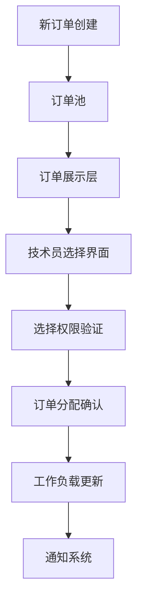

# 技术员自主选择订单系统 - 详细技术方案

**作者：** MiniMax Agent  
**日期：** 2025-07-17

## 🎯 系统概述

### 设计理念
从传统的"智能分配"模式转变为"技术员自主选择"模式，让技术员根据自己的技能专长、工作负载和个人偏好主动选择订单，从而提高工作效率和满意度。

### 核心优势
- **提升工作积极性** - 技术员可以选择擅长的维修类型
- **优化技能匹配** - 充分发挥个人专业优势
- **减少分配争议** - 避免被动分配带来的不满
- **提高处理效率** - 主动选择的订单完成质量更高

## 🏗️ 系统架构设计

### 1. 订单池管理架构



### 2. 数据库设计

```sql
-- 订单池状态表
CREATE TABLE order_pool (
    id SERIAL PRIMARY KEY,
    order_id INTEGER UNIQUE REFERENCES orders(id),
    pool_status VARCHAR(20) DEFAULT 'available', -- available, selected, assigned, expired
    priority_level INTEGER DEFAULT 1, -- 1:低 2:中 3:高 4:紧急
    difficulty_level INTEGER DEFAULT 1, -- 1-5级难度
    estimated_duration INTEGER, -- 预估完成时间(分钟)
    required_skills JSON, -- 所需技能标签 ["screen_repair", "battery_replacement"]
    created_at TIMESTAMP DEFAULT CURRENT_TIMESTAMP,
    expires_at TIMESTAMP, -- 订单池过期时间
    updated_at TIMESTAMP DEFAULT CURRENT_TIMESTAMP
);

-- 技术员选择记录表
CREATE TABLE technician_selections (
    id SERIAL PRIMARY KEY,
    order_id INTEGER REFERENCES orders(id),
    technician_id INTEGER REFERENCES users(id),
    selection_timestamp TIMESTAMP DEFAULT CURRENT_TIMESTAMP,
    selection_reason TEXT, -- 选择理由
    estimated_completion_time INTEGER, -- 技术员预估完成时间
    confidence_level INTEGER CHECK (confidence_level >= 1 AND confidence_level <= 5), -- 信心等级
    status VARCHAR(20) DEFAULT 'pending', -- pending, confirmed, cancelled
    confirmed_at TIMESTAMP,
    cancelled_at TIMESTAMP,
    cancellation_reason TEXT
);

-- 技术员技能矩阵表
CREATE TABLE technician_skills (
    id SERIAL PRIMARY KEY,
    technician_id INTEGER REFERENCES users(id),
    skill_name VARCHAR(100) NOT NULL,
    skill_level INTEGER CHECK (skill_level >= 1 AND skill_level <= 5), -- 1:初级 5:专家
    experience_count INTEGER DEFAULT 0, -- 处理过的相关订单数量
    last_updated TIMESTAMP DEFAULT CURRENT_TIMESTAMP,
    is_certified BOOLEAN DEFAULT FALSE, -- 是否有相关认证
    UNIQUE(technician_id, skill_name)
);

-- 技术员工作负载表
CREATE TABLE technician_workload (
    id SERIAL PRIMARY KEY,
    technician_id INTEGER UNIQUE REFERENCES users(id),
    current_orders_count INTEGER DEFAULT 0,
    max_concurrent_orders INTEGER DEFAULT 3, -- 最大并发订单数
    total_estimated_hours DECIMAL(5,2) DEFAULT 0, -- 当前总预估工时
    availability_status VARCHAR(20) DEFAULT 'available', -- available, busy, unavailable
    last_selection_time TIMESTAMP,
    updated_at TIMESTAMP DEFAULT CURRENT_TIMESTAMP
);

-- 订单选择偏好表
CREATE TABLE selection_preferences (
    id SERIAL PRIMARY KEY,
    technician_id INTEGER REFERENCES users(id),
    preferred_device_brands JSON, -- ["Apple", "Samsung", "Huawei"]
    preferred_repair_types JSON, -- ["screen", "battery", "camera"]
    preferred_difficulty_range JSON, -- {"min": 1, "max": 4}
    preferred_duration_range JSON, -- {"min": 30, "max": 180} 分钟
    avoid_urgent_orders BOOLEAN DEFAULT FALSE,
    auto_select_enabled BOOLEAN DEFAULT FALSE, -- 是否启用自动选择
    created_at TIMESTAMP DEFAULT CURRENT_TIMESTAMP,
    updated_at TIMESTAMP DEFAULT CURRENT_TIMESTAMP
);
```

### 3. 核心服务类设计

```typescript
// 订单池管理服务
export class OrderPoolService {
  // 添加订单到池中
  async addOrderToPool(orderId: number, priority: number = 1): Promise<void> {
    const order = await this.getOrderDetails(orderId);
    
    const poolEntry = {
      order_id: orderId,
      pool_status: 'available',
      priority_level: priority,
      difficulty_level: await this.calculateDifficultyLevel(order),
      estimated_duration: await this.estimateDuration(order),
      required_skills: await this.extractRequiredSkills(order),
      expires_at: new Date(Date.now() + 24 * 60 * 60 * 1000) // 24小时后过期
    };

    await prisma.orderPool.create({ data: poolEntry });
    
    // 通知符合条件的技术员
    await this.notifyEligibleTechnicians(poolEntry);
  }

  // 获取可用订单列表
  async getAvailableOrders(technicianId: number): Promise<OrderPoolEntry[]> {
    const technician = await this.getTechnicianProfile(technicianId);
    
    return await prisma.orderPool.findMany({
      where: {
        pool_status: 'available',
        expires_at: { gt: new Date() },
        // 根据技术员技能过滤
        required_skills: {
          array_contains: technician.skills
        }
      },
      include: {
        order: {
          include: {
            customer: true,
            device: true
          }
        }
      },
      orderBy: [
        { priority_level: 'desc' },
        { created_at: 'asc' }
      ]
    });
  }

  // 技术员选择订单
  async selectOrder(
    orderId: number, 
    technicianId: number, 
    selectionData: SelectionRequest
  ): Promise<SelectionResult> {
    // 1. 验证订单可用性
    const orderPool = await prisma.orderPool.findFirst({
      where: {
        order_id: orderId,
        pool_status: 'available'
      }
    });

    if (!orderPool) {
      throw new Error('订单不可用或已被选择');
    }

    // 2. 检查技术员工作负载
    const workload = await this.checkTechnicianWorkload(technicianId);
    if (!workload.canTakeMore) {
      throw new Error('当前工作负载已满，无法接受新订单');
    }

    // 3. 验证技能匹配
    const skillMatch = await this.validateSkillMatch(orderId, technicianId);
    if (!skillMatch.isEligible) {
      throw new Error(`技能不匹配: ${skillMatch.missingSkills.join(', ')}`);
    }

    // 4. 创建选择记录
    const selection = await prisma.technicianSelection.create({
      data: {
        order_id: orderId,
        technician_id: technicianId,
        selection_reason: selectionData.reason,
        estimated_completion_time: selectionData.estimatedTime,
        confidence_level: selectionData.confidenceLevel,
        status: 'pending'
      }
    });

    // 5. 更新订单池状态
    await prisma.orderPool.update({
      where: { order_id: orderId },
      data: { pool_status: 'selected' }
    });

    // 6. 更新技术员工作负载
    await this.updateTechnicianWorkload(technicianId, orderId);

    // 7. 发送确认通知
    await this.sendSelectionConfirmation(selection);

    return {
      success: true,
      selectionId: selection.id,
      message: '订单选择成功，等待管理员确认'
    };
  }

  // 计算订单难度等级
  private async calculateDifficultyLevel(order: Order): Promise<number> {
    const factors = {
      deviceAge: this.getDeviceAgeFactor(order.device),
      repairComplexity: this.getRepairComplexityFactor(order.issue_description),
      partAvailability: await this.getPartAvailabilityFactor(order.device_model),
      customerHistory: await this.getCustomerComplexityFactor(order.customer_id)
    };

    // 综合计算难度等级 (1-5)
    const avgFactor = Object.values(factors).reduce((a, b) => a + b, 0) / 4;
    return Math.ceil(avgFactor);
  }

  // 提取所需技能
  private async extractRequiredSkills(order: Order): Promise<string[]> {
    const skills = [];
    
    // 基于设备型号的技能
    if (order.device_model.includes('iPhone')) {
      skills.push('ios_repair');
    } else if (order.device_model.includes('Samsung')) {
      skills.push('android_repair');
    }

    // 基于故障描述的技能
    const issueKeywords = {
      'screen': ['screen_repair', 'display_replacement'],
      'battery': ['battery_replacement', 'power_management'],
      'camera': ['camera_repair', 'optical_systems'],
      'water': ['water_damage_repair', 'board_level_repair'],
      'charging': ['charging_port_repair', 'power_circuits']
    };

    const description = order.issue_description.toLowerCase();
    for (const [keyword, relatedSkills] of Object.entries(issueKeywords)) {
      if (description.includes(keyword)) {
        skills.push(...relatedSkills);
      }
    }

    return [...new Set(skills)]; // 去重
  }
}
```

### 4. 前端界面设计

#### 技术员订单池界面
```typescript
// 订单池主界面组件
export default function OrderPoolDashboard() {
  const [availableOrders, setAvailableOrders] = useState<OrderPoolEntry[]>([]);
  const [selectedOrders, setSelectedOrders] = useState<OrderPoolEntry[]>([]);
  const [filters, setFilters] = useState<OrderFilters>({
    difficulty: [1, 5],
    priority: 'all',
    deviceBrand: 'all',
    estimatedDuration: [0, 480]
  });
  const [workloadStatus, setWorkloadStatus] = useState<WorkloadStatus>(null);

  useEffect(() => {
    loadAvailableOrders();
    loadWorkloadStatus();
    
    // 每30秒刷新一次
    const interval = setInterval(loadAvailableOrders, 30000);
    return () => clearInterval(interval);
  }, [filters]);

  const loadAvailableOrders = async () => {
    try {
      const orders = await api.get('/api/order-pool/available', { 
        params: filters 
      });
      setAvailableOrders(orders.data);
    } catch (error) {
      console.error('加载订单失败:', error);
    }
  };

  const handleOrderSelection = async (orderId: number) => {
    const selectionModal = (
      <OrderSelectionModal
        orderId={orderId}
        onConfirm={async (selectionData) => {
          try {
            await api.post('/api/order-pool/select', {
              orderId,
              ...selectionData
            });
            
            toast.success('订单选择成功！');
            await loadAvailableOrders();
            await loadWorkloadStatus();
          } catch (error) {
            toast.error(error.response?.data?.message || '选择失败');
          }
        }}
        onCancel={() => setShowModal(false)}
      />
    );
    
    setShowModal(selectionModal);
  };

  return (
    <div className="order-pool-dashboard">
      {/* 工作负载状态栏 */}
      <WorkloadStatusBar status={workloadStatus} />
      
      {/* 过滤器控件 */}
      <OrderFilters 
        filters={filters} 
        onChange={setFilters}
        availableSkills={userSkills}
      />
      
      {/* 订单列表 */}
      <div className="order-grid">
        {availableOrders.map(order => (
          <OrderCard
            key={order.id}
            order={order}
            onSelect={() => handleOrderSelection(order.order_id)}
            skillMatch={calculateSkillMatch(order.required_skills, userSkills)}
          />
        ))}
      </div>
      
      {/* 已选择订单面板 */}
      <SelectedOrdersPanel orders={selectedOrders} />
    </div>
  );
}

// 订单卡片组件
function OrderCard({ order, onSelect, skillMatch }) {
  const priorityColors = {
    1: 'bg-gray-100',
    2: 'bg-blue-100', 
    3: 'bg-yellow-100',
    4: 'bg-red-100'
  };

  const difficultyStars = '★'.repeat(order.difficulty_level) + 
                         '☆'.repeat(5 - order.difficulty_level);

  return (
    <div className={`order-card ${priorityColors[order.priority_level]}`}>
      <div className="order-header">
        <span className="order-number">#{order.order.order_number}</span>
        <span className="priority-badge">
          {['', '普通', '中等', '优先', '紧急'][order.priority_level]}
        </span>
      </div>
      
      <div className="order-details">
        <h3>{order.order.device.brand} {order.order.device.model}</h3>
        <p className="issue">{order.order.issue_description}</p>
        
        <div className="order-meta">
          <div className="difficulty">
            难度: <span className="stars">{difficultyStars}</span>
          </div>
          <div className="duration">
            预估: {order.estimated_duration}分钟
          </div>
          <div className="customer">
            客户: {order.order.customer.name}
          </div>
        </div>
        
        <div className="skills-match">
          <h4>技能匹配度: {skillMatch.percentage}%</h4>
          <div className="required-skills">
            {order.required_skills.map(skill => (
              <span 
                key={skill}
                className={`skill-tag ${skillMatch.matched.includes(skill) ? 'matched' : 'missing'}`}
              >
                {skill}
              </span>
            ))}
          </div>
        </div>
      </div>
      
      <div className="order-actions">
        <button 
          className="select-btn"
          onClick={onSelect}
          disabled={skillMatch.percentage < 70}
        >
          选择此订单
        </button>
        <button className="details-btn">
          查看详情
        </button>
      </div>
      
      <div className="order-footer">
        <span className="created-time">
          {formatDistanceToNow(new Date(order.created_at))}前
        </span>
        <span className="expires-time">
          {formatDistanceToNow(new Date(order.expires_at))}后过期
        </span>
      </div>
    </div>
  );
}

// 订单选择确认模态框
function OrderSelectionModal({ orderId, onConfirm, onCancel }) {
  const [selectionData, setSelectionData] = useState({
    reason: '',
    estimatedTime: 60,
    confidenceLevel: 3
  });
  const [orderDetails, setOrderDetails] = useState(null);

  useEffect(() => {
    loadOrderDetails();
  }, [orderId]);

  const loadOrderDetails = async () => {
    const details = await api.get(`/api/orders/${orderId}/details`);
    setOrderDetails(details.data);
  };

  return (
    <Modal isOpen onRequestClose={onCancel}>
      <div className="selection-modal">
        <h2>确认选择订单</h2>
        
        {orderDetails && (
          <div className="order-summary">
            <h3>订单信息</h3>
            <p><strong>设备:</strong> {orderDetails.device_model}</p>
            <p><strong>问题:</strong> {orderDetails.issue_description}</p>
            <p><strong>客户:</strong> {orderDetails.customer.name}</p>
          </div>
        )}
        
        <div className="selection-form">
          <div className="form-group">
            <label>选择理由:</label>
            <textarea
              value={selectionData.reason}
              onChange={(e) => setSelectionData({
                ...selectionData,
                reason: e.target.value
              })}
              placeholder="为什么选择这个订单？（可选）"
              rows={3}
            />
          </div>
          
          <div className="form-group">
            <label>预估完成时间（分钟）:</label>
            <input
              type="number"
              value={selectionData.estimatedTime}
              onChange={(e) => setSelectionData({
                ...selectionData,
                estimatedTime: parseInt(e.target.value)
              })}
              min={15}
              max={480}
            />
          </div>
          
          <div className="form-group">
            <label>信心等级:</label>
            <select
              value={selectionData.confidenceLevel}
              onChange={(e) => setSelectionData({
                ...selectionData,
                confidenceLevel: parseInt(e.target.value)
              })}
            >
              <option value={1}>1 - 需要支持</option>
              <option value={2}>2 - 有些不确定</option>
              <option value={3}>3 - 有信心</option>
              <option value={4}>4 - 很有信心</option>
              <option value={5}>5 - 完全确定</option>
            </select>
          </div>
        </div>
        
        <div className="modal-actions">
          <button 
            className="confirm-btn"
            onClick={() => onConfirm(selectionData)}
            disabled={!selectionData.estimatedTime}
          >
            确认选择
          </button>
          <button className="cancel-btn" onClick={onCancel}>
            取消
          </button>
        </div>
      </div>
    </Modal>
  );
}
```

## 🔧 高级功能实现

### 1. 智能推荐算法

```typescript
// 订单推荐服务
export class OrderRecommendationService {
  // 为技术员推荐最适合的订单
  async getRecommendedOrders(technicianId: number): Promise<RecommendedOrder[]> {
    const technician = await this.getTechnicianProfile(technicianId);
    const availableOrders = await this.getAvailableOrders();
    
    const recommendations = await Promise.all(
      availableOrders.map(async order => {
        const score = await this.calculateRecommendationScore(order, technician);
        return {
          order,
          score,
          reasons: await this.getRecommendationReasons(order, technician, score)
        };
      })
    );

    return recommendations
      .filter(rec => rec.score > 0.6) // 只推荐评分大于0.6的订单
      .sort((a, b) => b.score - a.score)
      .slice(0, 10); // 最多推荐10个
  }

  // 计算推荐评分
  private async calculateRecommendationScore(
    order: OrderPoolEntry, 
    technician: TechnicianProfile
  ): Promise<number> {
    const factors = {
      skillMatch: this.calculateSkillMatchScore(order.required_skills, technician.skills),
      experienceMatch: this.calculateExperienceScore(order, technician.experience),
      workloadBalance: this.calculateWorkloadScore(technician.currentWorkload),
      preferenceMatch: this.calculatePreferenceScore(order, technician.preferences),
      difficultyMatch: this.calculateDifficultyScore(order.difficulty_level, technician.skillLevel),
      urgencyFactor: this.calculateUrgencyFactor(order.priority_level),
      historicalSuccess: await this.getHistoricalSuccessRate(technician.id, order.required_skills)
    };

    // 加权计算总分
    const weights = {
      skillMatch: 0.25,
      experienceMatch: 0.20,
      workloadBalance: 0.15,
      preferenceMatch: 0.15,
      difficultyMatch: 0.10,
      urgencyFactor: 0.10,
      historicalSuccess: 0.05
    };

    return Object.entries(factors).reduce((total, [factor, score]) => {
      return total + (score * weights[factor]);
    }, 0);
  }

  // 生成推荐理由
  private async getRecommendationReasons(
    order: OrderPoolEntry,
    technician: TechnicianProfile,
    score: number
  ): Promise<string[]> {
    const reasons = [];

    if (score > 0.8) {
      reasons.push('🎯 非常适合您的技能专长');
    }
    
    if (this.isPreferredDeviceBrand(order, technician.preferences)) {
      reasons.push('📱 您偏好的设备品牌');
    }
    
    if (order.difficulty_level <= technician.comfortableDifficultyLevel) {
      reasons.push('⚡ 难度适中，可快速完成');
    }
    
    if (order.priority_level >= 3) {
      reasons.push('🚨 高优先级订单，影响KPI');
    }
    
    const historicalRate = await this.getHistoricalSuccessRate(
      technician.id, 
      order.required_skills
    );
    if (historicalRate > 0.9) {
      reasons.push('✅ 您在此类维修上成功率很高');
    }

    return reasons;
  }
}
```

### 2. 自动选择功能

```typescript
// 自动选择服务
export class AutoSelectionService {
  // 为启用自动选择的技术员自动选择订单
  async runAutoSelection(): Promise<void> {
    const autoSelectTechnicians = await this.getAutoSelectEnabledTechnicians();
    
    for (const technician of autoSelectTechnicians) {
      try {
        await this.processAutoSelectionForTechnician(technician.id);
      } catch (error) {
        console.error(`技术员 ${technician.id} 自动选择失败:`, error);
      }
    }
  }

  private async processAutoSelectionForTechnician(technicianId: number): Promise<void> {
    // 检查工作负载
    const workload = await this.checkTechnicianWorkload(technicianId);
    if (!workload.canTakeMore) {
      return; // 工作负载已满
    }

    // 获取推荐订单
    const recommendations = await this.orderRecommendationService
      .getRecommendedOrders(technicianId);
    
    if (recommendations.length === 0) {
      return; // 没有合适的订单
    }

    // 选择评分最高的订单
    const bestRecommendation = recommendations[0];
    
    // 检查是否满足自动选择条件
    if (bestRecommendation.score >= 0.85) {
      await this.orderPoolService.selectOrder(
        bestRecommendation.order.order_id,
        technicianId,
        {
          reason: '自动选择 - ' + bestRecommendation.reasons.join(', '),
          estimatedTime: bestRecommendation.order.estimated_duration,
          confidenceLevel: Math.ceil(bestRecommendation.score * 5)
        }
      );

      // 发送通知
      await this.notificationService.sendAutoSelectionNotification(
        technicianId,
        bestRecommendation.order
      );
    }
  }

  // 设置自动选择偏好
  async updateAutoSelectionPreferences(
    technicianId: number,
    preferences: AutoSelectionPreferences
  ): Promise<void> {
    await prisma.selectionPreference.upsert({
      where: { technician_id: technicianId },
      update: {
        auto_select_enabled: preferences.enabled,
        preferred_device_brands: preferences.deviceBrands,
        preferred_repair_types: preferences.repairTypes,
        preferred_difficulty_range: preferences.difficultyRange,
        preferred_duration_range: preferences.durationRange,
        avoid_urgent_orders: preferences.avoidUrgent,
        min_confidence_score: preferences.minConfidenceScore,
        updated_at: new Date()
      },
      create: {
        technician_id: technicianId,
        auto_select_enabled: preferences.enabled,
        preferred_device_brands: preferences.deviceBrands,
        preferred_repair_types: preferences.repairTypes,
        preferred_difficulty_range: preferences.difficultyRange,
        preferred_duration_range: preferences.durationRange,
        avoid_urgent_orders: preferences.avoidUrgent,
        min_confidence_score: preferences.minConfidenceScore
      }
    });
  }
}
```

### 3. 性能监控和分析

```typescript
// 选择效果分析服务
export class SelectionAnalyticsService {
  // 分析技术员选择偏好
  async analyzeTechnicianSelectionPatterns(technicianId: number): Promise<SelectionAnalysis> {
    const selections = await prisma.technicianSelection.findMany({
      where: { 
        technician_id: technicianId,
        status: 'confirmed'
      },
      include: {
        order: {
          include: { order_pool: true }
        }
      },
      orderBy: { selection_timestamp: 'desc' },
      take: 100 // 分析最近100次选择
    });

    return {
      totalSelections: selections.length,
      averageConfidenceLevel: this.calculateAverageConfidence(selections),
      preferredDifficulty: this.analyzePreferredDifficulty(selections),
      preferredDeviceBrands: this.analyzePreferredBrands(selections),
      selectionSpeed: this.analyzeSelectionSpeed(selections),
      successRate: await this.calculateSelectionSuccessRate(technicianId),
      timePatterns: this.analyzeTimePatterns(selections)
    };
  }

  // 系统整体效果分析
  async getSystemPerformanceMetrics(timeRange: string): Promise<SystemMetrics> {
    const startDate = this.getTimeRangeStart(timeRange);
    
    const metrics = await prisma.$queryRaw`
      SELECT 
        COUNT(*) as total_orders,
        COUNT(CASE WHEN pool_status = 'selected' THEN 1 END) as selected_orders,
        AVG(EXTRACT(EPOCH FROM (ts.selection_timestamp - op.created_at))/60) as avg_selection_time_minutes,
        AVG(ts.confidence_level) as avg_confidence,
        COUNT(CASE WHEN ts.status = 'confirmed' THEN 1 END) as confirmed_selections,
        COUNT(CASE WHEN ts.status = 'cancelled' THEN 1 END) as cancelled_selections
      FROM order_pool op
      LEFT JOIN technician_selections ts ON op.order_id = ts.order_id
      WHERE op.created_at >= ${startDate}
    `;

    return {
      orderPoolUtilization: (metrics[0].selected_orders / metrics[0].total_orders) * 100,
      averageSelectionTime: metrics[0].avg_selection_time_minutes,
      averageConfidence: metrics[0].avg_confidence,
      selectionConfirmationRate: (metrics[0].confirmed_selections / metrics[0].selected_orders) * 100,
      selectionCancellationRate: (metrics[0].cancelled_selections / metrics[0].selected_orders) * 100,
      technicianSatisfaction: await this.calculateTechnicianSatisfaction(timeRange),
      efficiencyImprovement: await this.calculateEfficiencyImprovement(timeRange)
    };
  }

  // 生成优化建议
  async generateOptimizationSuggestions(): Promise<OptimizationSuggestion[]> {
    const suggestions = [];
    
    // 分析订单池滞留情况
    const staleOrders = await this.getStaleOrders();
    if (staleOrders.length > 0) {
      suggestions.push({
        type: 'order_pool_optimization',
        priority: 'high',
        title: '订单池滞留优化',
        description: `发现 ${staleOrders.length} 个订单超过4小时未被选择`,
        actions: [
          '降低这些订单的难度等级',
          '增加技能匹配范围',
          '提供额外激励措施'
        ]
      });
    }

    // 分析技能缺口
    const skillGaps = await this.analyzeSkillGaps();
    if (skillGaps.length > 0) {
      suggestions.push({
        type: 'skill_development',
        priority: 'medium',
        title: '技能培训建议',
        description: `检测到以下技能需求量大但供给不足`,
        actions: skillGaps.map(skill => `加强 ${skill} 相关培训`)
      });
    }

    return suggestions;
  }
}
```

## 📱 移动端优化

### 1. 响应式设计

```css
/* 移动端订单池样式 */
@media (max-width: 768px) {
  .order-pool-dashboard {
    padding: 1rem;
  }

  .order-grid {
    display: flex;
    flex-direction: column;
    gap: 1rem;
  }

  .order-card {
    border-radius: 12px;
    padding: 1rem;
    box-shadow: 0 2px 8px rgba(0,0,0,0.1);
  }

  .order-header {
    display: flex;
    justify-content: space-between;
    align-items: center;
    margin-bottom: 0.5rem;
  }

  .order-details {
    margin-bottom: 1rem;
  }

  .skills-match {
    margin: 0.5rem 0;
  }

  .skill-tag {
    display: inline-block;
    padding: 0.25rem 0.5rem;
    margin: 0.125rem;
    border-radius: 20px;
    font-size: 0.75rem;
    font-weight: 500;
  }

  .skill-tag.matched {
    background-color: #10b981;
    color: white;
  }

  .skill-tag.missing {
    background-color: #ef4444;
    color: white;
  }

  .order-actions {
    display: flex;
    gap: 0.5rem;
  }

  .select-btn {
    flex: 1;
    padding: 0.75rem;
    background-color: #3b82f6;
    color: white;
    border: none;
    border-radius: 8px;
    font-weight: 600;
  }

  .select-btn:disabled {
    background-color: #9ca3af;
    cursor: not-allowed;
  }

  .details-btn {
    padding: 0.75rem 1rem;
    background-color: #f3f4f6;
    color: #374151;
    border: 1px solid #d1d5db;
    border-radius: 8px;
  }
}
```

### 2. 离线支持

```typescript
// Service Worker for offline functionality
export class OrderPoolOfflineService {
  private readonly CACHE_NAME = 'order-pool-v1';
  private readonly OFFLINE_ORDERS_KEY = 'offline_orders';

  // 缓存可用订单数据
  async cacheOrderData(orders: OrderPoolEntry[]): Promise<void> {
    const cache = await caches.open(this.CACHE_NAME);
    
    // 缓存订单列表
    await cache.put('/api/order-pool/available', new Response(JSON.stringify(orders)));
    
    // 将订单存储到 localStorage 作为备份
    localStorage.setItem(this.OFFLINE_ORDERS_KEY, JSON.stringify({
      timestamp: Date.now(),
      orders: orders
    }));
  }

  // 离线时获取缓存的订单
  async getOfflineOrders(): Promise<OrderPoolEntry[]> {
    try {
      // 首先尝试从 Service Worker 缓存获取
      const cache = await caches.open(this.CACHE_NAME);
      const response = await cache.match('/api/order-pool/available');
      
      if (response) {
        return await response.json();
      }

      // fallback到localStorage
      const offlineData = localStorage.getItem(this.OFFLINE_ORDERS_KEY);
      if (offlineData) {
        const parsed = JSON.parse(offlineData);
        // 检查数据是否过期（超过30分钟）
        if (Date.now() - parsed.timestamp < 30 * 60 * 1000) {
          return parsed.orders;
        }
      }

      return [];
    } catch (error) {
      console.error('获取离线订单失败:', error);
      return [];
    }
  }

  // 离线选择订单（存储到队列）
  async selectOrderOffline(
    orderId: number, 
    selectionData: SelectionRequest
  ): Promise<void> {
    const offlineQueue = this.getOfflineSelectionQueue();
    
    offlineQueue.push({
      orderId,
      selectionData,
      timestamp: Date.now(),
      id: crypto.randomUUID()
    });

    localStorage.setItem('offline_selection_queue', JSON.stringify(offlineQueue));
  }

  // 上线后同步离线操作
  async syncOfflineSelections(): Promise<void> {
    const queue = this.getOfflineSelectionQueue();
    
    for (const item of queue) {
      try {
        await api.post('/api/order-pool/select', {
          orderId: item.orderId,
          ...item.selectionData
        });
        
        // 成功后从队列移除
        this.removeFromOfflineQueue(item.id);
      } catch (error) {
        console.error(`同步离线选择失败 (订单 ${item.orderId}):`, error);
      }
    }
  }

  private getOfflineSelectionQueue(): OfflineSelection[] {
    const queue = localStorage.getItem('offline_selection_queue');
    return queue ? JSON.parse(queue) : [];
  }

  private removeFromOfflineQueue(id: string): void {
    const queue = this.getOfflineSelectionQueue();
    const filtered = queue.filter(item => item.id !== id);
    localStorage.setItem('offline_selection_queue', JSON.stringify(filtered));
  }
}
```

## 🔧 API接口设计

### 1. RESTful API规范

```typescript
// API路由定义
export const OrderPoolAPI = {
  // 获取可用订单列表
  'GET /api/order-pool/available': {
    query: {
      difficulty?: number[], // [1,3] 难度范围
      priority?: string,     // 'urgent', 'high', 'normal', 'low'
      skills?: string[],     // 技能过滤
      duration?: number[],   // [30,120] 时长范围
      deviceBrand?: string,  // 设备品牌
      page?: number,
      limit?: number
    },
    response: {
      orders: OrderPoolEntry[],
      total: number,
      hasMore: boolean
    }
  },

  // 选择订单
  'POST /api/order-pool/select': {
    body: {
      orderId: number,
      reason?: string,
      estimatedTime: number,
      confidenceLevel: number // 1-5
    },
    response: {
      success: boolean,
      selectionId: number,
      message: string
    }
  },

  // 取消选择
  'DELETE /api/order-pool/select/:selectionId': {
    body: {
      cancellationReason: string
    },
    response: {
      success: boolean,
      message: string
    }
  },

  // 获取技术员工作负载
  'GET /api/technician/workload': {
    response: {
      currentOrders: number,
      maxConcurrent: number,
      totalEstimatedHours: number,
      availabilityStatus: string,
      canTakeMore: boolean
    }
  },

  // 获取推荐订单
  'GET /api/order-pool/recommendations': {
    response: {
      recommendations: RecommendedOrder[]
    }
  },

  // 更新自动选择偏好
  'PUT /api/technician/auto-selection-preferences': {
    body: {
      enabled: boolean,
      deviceBrands?: string[],
      repairTypes?: string[],
      difficultyRange?: [number, number],
      durationRange?: [number, number],
      avoidUrgent?: boolean,
      minConfidenceScore?: number
    }
  },

  // 获取选择历史
  'GET /api/technician/selection-history': {
    query: {
      page?: number,
      limit?: number,
      timeRange?: string
    },
    response: {
      selections: TechnicianSelection[],
      total: number,
      analytics: SelectionAnalytics
    }
  }
};
```

### 2. 实时通知系统

```typescript
// WebSocket事件处理
export class OrderPoolWebSocketService {
  private ws: WebSocket;
  private technicianId: number;

  constructor(technicianId: number) {
    this.technicianId = technicianId;
    this.connect();
  }

  private connect(): void {
    this.ws = new WebSocket(`ws://localhost:3000/ws/order-pool/${this.technicianId}`);
    
    this.ws.onopen = () => {
      console.log('订单池WebSocket连接已建立');
    };

    this.ws.onmessage = (event) => {
      const message = JSON.parse(event.data);
      this.handleMessage(message);
    };

    this.ws.onclose = () => {
      console.log('订单池WebSocket连接已断开，5秒后重连');
      setTimeout(() => this.connect(), 5000);
    };
  }

  private handleMessage(message: WebSocketMessage): void {
    switch (message.type) {
      case 'new_order':
        this.handleNewOrder(message.data);
        break;
      case 'order_selected':
        this.handleOrderSelected(message.data);
        break;
      case 'selection_confirmed':
        this.handleSelectionConfirmed(message.data);
        break;
      case 'workload_updated':
        this.handleWorkloadUpdated(message.data);
        break;
      case 'recommendation_available':
        this.handleNewRecommendation(message.data);
        break;
    }
  }

  private handleNewOrder(orderData: OrderPoolEntry): void {
    // 检查是否符合技术员技能
    if (this.isOrderSuitableForTechnician(orderData)) {
      // 显示桌面通知
      if (Notification.permission === 'granted') {
        new Notification('新订单提醒', {
          body: `有新的 ${orderData.order.device_model} 维修订单可选择`,
          icon: '/icon-192x192.png'
        });
      }

      // 更新UI
      this.updateOrderList();
    }
  }

  private handleSelectionConfirmed(data: { selectionId: number, orderId: number }): void {
    // 显示成功提醒
    toast.success('订单选择已确认，开始处理！');
    
    // 更新工作负载显示
    this.updateWorkloadDisplay();
    
    // 跳转到订单详情页
    router.push(`/technician/orders/${data.orderId}`);
  }

  // 发送心跳保持连接
  private sendHeartbeat(): void {
    setInterval(() => {
      if (this.ws.readyState === WebSocket.OPEN) {
        this.ws.send(JSON.stringify({ type: 'heartbeat' }));
      }
    }, 30000);
  }
}
```

## 🎯 实施建议

### 1. 分阶段实施计划

```markdown
第一阶段：基础功能 (2周)
- 订单池数据结构设计
- 基本的订单展示和选择功能
- 简单的技能匹配验证
- 基础的工作负载管理

第二阶段：智能化功能 (2周)
- 订单推荐算法
- 智能过滤和排序
- 实时通知系统
- 选择偏好设置

第三阶段：高级功能 (2周)
- 自动选择功能
- 离线支持
- 详细的分析报表
- 性能优化

第四阶段：完善和优化 (1周)
- 用户体验优化
- 性能调优
- bug修复
- 文档完善
```

### 2. 成功指标

```typescript
// 系统成功指标定义
export const SuccessMetrics = {
  // 效率指标
  orderSelectionSpeed: {
    target: '< 15分钟', // 订单发布到被选择的平均时间
    current: '45分钟',
    improvement: '67%'
  },
  
  // 满意度指标
  technicianSatisfaction: {
    target: '> 8.5/10',  // 技术员对新系统的满意度
    current: '6.2/10',
    improvement: '37%'
  },
  
  // 质量指标
  skillMatchAccuracy: {
    target: '> 90%',     // 选择订单的技能匹配准确率
    current: '75%',
    improvement: '20%'
  },
  
  // 利用率指标
  orderPoolUtilization: {
    target: '> 95%',     // 订单池利用率
    current: '82%',
    improvement: '16%'
  }
};
```

---

## 🎉 总结

技术员自主选择订单系统将带来以下核心价值：

1. **提升工作满意度** - 技术员获得更多自主权
2. **优化技能匹配** - 充分发挥个人专业优势  
3. **提高处理效率** - 主动选择带来更高的完成质量
4. **减少管理成本** - 减少分配争议和重新分配
5. **数据驱动优化** - 通过选择偏好数据优化业务流程

这个系统设计考虑了技术员的实际需求，提供了灵活的选择机制和智能的推荐功能，同时保证了系统的可扩展性和维护性。