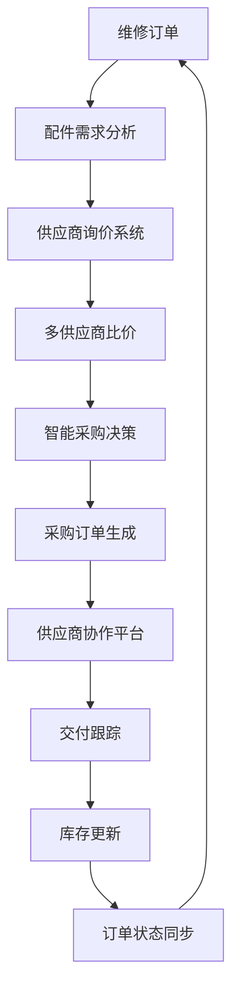
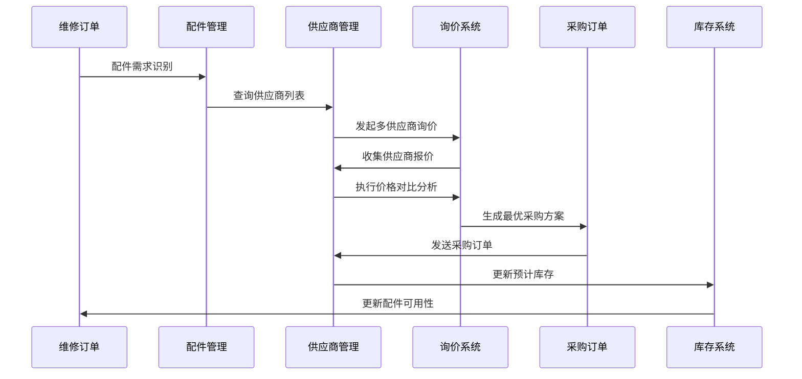

# 订单管理与供应商集成系统 - 详细设计方案

**作者：** MiniMax Agent  
**日期：** 2025-07-17

## 系统概述

本方案设计了一个深度集成的订单管理与供应商系统，实现多供应商价格对比、智能采购决策、动态报价、供应商协作等核心功能，确保维修订单与供应商采购的无缝连接。

## 🔄 集成架构设计

### 系统集成模型


### 数据流集成


## 📊 核心功能模块

### 1. 智能供应商匹配系统

#### 1.1 配件需求智能识别
```typescript
interface PartRequirementAnalysis {
  orderId: string;
  deviceInfo: {
    brand: string;
    model: string;
    issueType: string;
  };
  
  requiredParts: Array<{
    partId: string;
    partName: string;
    partNumber: string;
    category: string;
    specification: Record<string, any>;
    quantity: number;
    urgency: 'low' | 'normal' | 'high' | 'critical';
    qualityRequirement: 'original' | 'oem' | 'aftermarket' | 'any';
    maxAcceptablePrice: number;
    preferredBrands: string[];
    compatibleAlternatives: string[];
  }>;
  
  deliveryRequirements: {
    requiredBy: Date;
    deliveryAddress: string;
    preferredSuppliers: string[];
    excludedSuppliers: string[];
    maxLeadTime: number; // 天数
  };
  
  budgetConstraints: {
    maxTotalBudget: number;
    preferredPriceRange: {
      min: number;
      max: number;
    };
    discountExpectation: number;
  };
}
```

#### 1.2 供应商智能匹配算法
```typescript
interface SupplierMatchingCriteria {
  // 配件匹配度
  partCompatibility: {
    hasExactMatch: boolean;
    hasCompatibleAlternative: boolean;
    qualityGrade: number; // 1-10
    brandAlignment: number; // 1-10
  };
  
  // 供应商能力评估
  supplierCapability: {
    deliveryCapability: number; // 1-10
    qualityHistory: number; // 1-10
    priceCompetitiveness: number; // 1-10
    serviceLevel: number; // 1-10
    reliability: number; // 1-10
  };
  
  // 历史合作表现
  historicalPerformance: {
    onTimeDeliveryRate: number;
    qualityDefectRate: number;
    priceStability: number;
    communicationEffectiveness: number;
    problemResolutionSpeed: number;
  };
  
  // 商务条件
  businessTerms: {
    paymentTerms: string;
    minimumOrderValue: number;
    bulkDiscountAvailable: boolean;
    returnPolicy: string;
    warrantyOffered: number; // 月数
  };
  
  // 综合匹配得分
  overallScore: number; // 1-100
  recommendationLevel: 'highly_recommended' | 'recommended' | 'acceptable' | 'not_recommended';
}
```

### 2. 多供应商询价系统

#### 2.1 自动化询价流程
```typescript
interface RFQRequest {
  rfqId: string;
  orderId: string;
  createdBy: string;
  
  // 询价基础信息
  basicInfo: {
    title: string;
    description: string;
    rfqNumber: string;
    issueDate: Date;
    responseDeadline: Date;
    validityPeriod: number; // 天数
  };
  
  // 配件详情
  items: Array<{
    itemId: string;
    partName: string;
    partNumber: string;
    specification: Record<string, any>;
    quantity: number;
    unitOfMeasure: string;
    qualityRequirement: string;
    alternativesAccepted: boolean;
    urgency: string;
    deliveryDate: Date;
  }>;
  
  // 商务要求
  commercialTerms: {
    paymentTerms: string[];
    deliveryTerms: string;
    warrantyRequirement: number;
    returnPolicy: string;
    priceValidityPeriod: number;
  };
  
  // 技术要求
  technicalRequirements: {
    certificationRequired: string[];
    testingRequired: boolean;
    packagingRequirements: string;
    documentationRequired: string[];
  };
  
  // 供应商选择
  targetSuppliers: Array<{
    supplierId: string;
    invitationMethod: 'email' | 'platform' | 'phone' | 'fax';
    customMessage?: string;
    priority: 'high' | 'medium' | 'low';
  }>;
}

interface RFQResponse {
  responseId: string;
  rfqId: string;
  supplierId: string;
  submittedAt: Date;
  
  // 报价信息
  quotation: {
    items: Array<{
      itemId: string;
      quotedPart: {
        partName: string;
        partNumber: string;
        brand: string;
        origin: string;
        quality: string;
      };
      pricing: {
        unitPrice: number;
        quantity: number;
        totalPrice: number;
        currency: string;
        discounts: Array<{
          type: string;
          condition: string;
          percentage: number;
        }>;
      };
      delivery: {
        leadTime: number;
        deliveryDate: Date;
        shippingCost: number;
        incoterms: string;
      };
      warranty: {
        period: number;
        coverage: string;
        conditions: string;
      };
    }>;
    
    totalValue: number;
    totalShipping: number;
    taxes: number;
    grandTotal: number;
  };
  
  // 商务条款
  commercialTerms: {
    paymentTerms: string;
    priceValidityPeriod: number;
    minimumOrderValue: number;
    bulkDiscountThreshold: number;
    returnPolicy: string;
  };
  
  // 附加信息
  additionalInfo: {
    certifications: string[];
    sampleAvailable: boolean;
    customizationPossible: boolean;
    urgentDeliveryOption: boolean;
    technicalSupport: string;
    specialOffers: string;
  };
  
  // 状态跟踪
  status: 'submitted' | 'under_review' | 'accepted' | 'rejected' | 'negotiating';
  reviewNotes: string;
  attachments: string[];
}
```

#### 2.2 价格对比分析系统
```typescript
interface SupplierComparison {
  rfqId: string;
  comparisonDate: Date;
  
  // 价格对比
  priceComparison: {
    summary: {
      lowestPrice: number;
      highestPrice: number;
      averagePrice: number;
      priceVariance: number;
      recommendedPrice: number;
    };
    
    bySupplier: Array<{
      supplierId: string;
      supplierName: string;
      totalPrice: number;
      priceRank: number;
      priceAdvantage: number; // 相对于平均价格的优势百分比
      
      itemBreakdown: Array<{
        itemId: string;
        unitPrice: number;
        quantity: number;
        totalPrice: number;
        competitivePosition: 'lowest' | 'competitive' | 'average' | 'high' | 'highest';
      }>;
    }>;
  };
  
  // 交付对比
  deliveryComparison: {
    summary: {
      fastestDelivery: number;
      slowestDelivery: number;
      averageDelivery: number;
    };
    
    bySupplier: Array<{
      supplierId: string;
      supplierName: string;
      leadTime: number;
      deliveryDate: Date;
      deliveryRank: number;
      urgentDeliveryAvailable: boolean;
      shippingCost: number;
    }>;
  };
  
  // 质量对比
  qualityComparison: {
    bySupplier: Array<{
      supplierId: string;
      supplierName: string;
      qualityScore: number;
      certifications: string[];
      warrantyPeriod: number;
      historicalQualityRating: number;
      defectRate: number;
    }>;
  };
  
  // 商务条款对比
  commercialComparison: {
    bySupplier: Array<{
      supplierId: string;
      supplierName: string;
      paymentTerms: string;
      paymentTermsScore: number; // 有利程度评分
      minimumOrder: number;
      bulkDiscounts: boolean;
      returnPolicy: string;
      priceValidityPeriod: number;
    }>;
  };
  
  // 综合评分
  overallRanking: Array<{
    rank: number;
    supplierId: string;
    supplierName: string;
    overallScore: number;
    priceScore: number;
    deliveryScore: number;
    qualityScore: number;
    commercialScore: number;
    recommendation: 'strongly_recommended' | 'recommended' | 'acceptable' | 'not_recommended';
    reason: string;
  }>;
}
```

### 3. 智能采购决策引擎

#### 3.1 决策算法配置
```typescript
interface PurchaseDecisionEngine {
  // 决策权重配置
  decisionWeights: {
    price: number; // 价格权重 0-1
    delivery: number; // 交付权重 0-1
    quality: number; // 质量权重 0-1
    reliability: number; // 可靠性权重 0-1
    service: number; // 服务权重 0-1
    relationship: number; // 合作关系权重 0-1
  };
  
  // 决策规则
  decisionRules: Array<{
    ruleId: string;
    ruleName: string;
    condition: string; // 条件表达式
    action: string; // 执行动作
    priority: number; // 优先级
    isActive: boolean;
  }>;
  
  // 自动决策阈值
  autoDecisionThresholds: {
    maxPriceDifference: number; // 最大价格差异百分比
    minQualityScore: number; // 最低质量分数
    maxLeadTime: number; // 最大交付时间
    minSupplierRating: number; // 最低供应商评级
  };
  
  // 风险评估参数
  riskAssessment: {
    supplierConcentrationLimit: number; // 单一供应商依赖度限制
    newSupplierRiskWeight: number; // 新供应商风险权重
    geographicalRiskWeight: number; // 地理风险权重
    financialStabilityWeight: number; // 财务稳定性权重
  };
}

interface PurchaseRecommendation {
  recommendationId: string;
  rfqId: string;
  generatedAt: Date;
  
  // 推荐方案
  primaryRecommendation: {
    supplierId: string;
    supplierName: string;
    totalValue: number;
    totalDeliveryTime: number;
    overallScore: number;
    confidenceLevel: number; // 0-1
    
    advantages: string[];
    disadvantages: string[];
    risks: string[];
    mitigation: string[];
  };
  
  // 备选方案
  alternativeOptions: Array<{
    supplierId: string;
    supplierName: string;
    totalValue: number;
    totalDeliveryTime: number;
    overallScore: number;
    reason: string; // 为什么作为备选
  }>;
  
  // 拆分采购建议（如果适用）
  splitPurchaseOption?: {
    reason: string;
    suppliers: Array<{
      supplierId: string;
      supplierName: string;
      items: string[];
      value: number;
      advantage: string;
    }>;
    totalValue: number;
    riskMitigation: string;
  };
  
  // 决策依据
  decisionRationale: {
    keyFactors: string[];
    tradeOffs: string[];
    riskConsiderations: string[];
    businessImpact: string;
  };
  
  // 需要人工审核的原因
  manualReviewRequired?: {
    reasons: string[];
    urgency: 'low' | 'medium' | 'high';
    approvalLevel: 'supervisor' | 'manager' | 'director';
  };
}
```

#### 3.2 采购订单自动生成
```typescript
interface AutoPurchaseOrder {
  // 基础信息
  poNumber: string;
  rfqId: string;
  originalOrderId: string; // 关联的维修订单
  supplierId: string;
  createdBy: string;
  approvedBy?: string;
  
  // 订单状态
  status: 'draft' | 'pending_approval' | 'approved' | 'sent_to_supplier' | 'acknowledged' | 'in_production' | 'shipped' | 'delivered' | 'completed' | 'cancelled';
  
  // 供应商信息
  supplier: {
    name: string;
    contactPerson: string;
    email: string;
    phone: string;
    address: string;
    paymentTerms: string;
  };
  
  // 订单项目
  items: Array<{
    lineNumber: number;
    partId: string;
    partName: string;
    partNumber: string;
    description: string;
    quantity: number;
    unitPrice: number;
    totalPrice: number;
    
    delivery: {
      requestedDate: Date;
      confirmedDate?: Date;
      actualDate?: Date;
      deliveryAddress: string;
    };
    
    quality: {
      specification: string;
      inspectionRequired: boolean;
      certificationRequired: boolean;
      warrantyPeriod: number;
    };
    
    status: 'pending' | 'confirmed' | 'in_production' | 'shipped' | 'delivered' | 'accepted' | 'rejected';
  }>;
  
  // 财务信息
  financial: {
    subtotal: number;
    shipping: number;
    taxes: number;
    discounts: number;
    total: number;
    currency: string;
    exchangeRate?: number;
  };
  
  // 交付信息
  delivery: {
    method: string;
    address: string;
    contact: string;
    instructions: string;
    trackingNumber?: string;
  };
  
  // 质量要求
  qualityRequirements: {
    inspectionLevel: 'normal' | 'tightened' | 'reduced';
    certificationRequired: string[];
    testingRequired: boolean;
    documentationRequired: string[];
  };
  
  // 合同条款
  terms: {
    paymentTerms: string;
    deliveryTerms: string;
    warrantyTerms: string;
    returnPolicy: string;
    penaltyClause: string;
  };
  
  // 审批流程
  approvalWorkflow: Array<{
    step: number;
    approverRole: string;
    approverName?: string;
    status: 'pending' | 'approved' | 'rejected';
    timestamp?: Date;
    comments?: string;
  }>;
}
```

### 4. 供应商协作平台

#### 4.1 供应商门户系统
```typescript
interface SupplierPortal {
  // 供应商基础信息
  supplierInfo: {
    companyProfile: {
      companyName: string;
      businessLicense: string;
      taxId: string;
      establishedYear: number;
      employeeCount: number;
      annualRevenue: number;
      certifications: string[];
      mainProducts: string[];
      servingIndustries: string[];
    };
    
    contactInformation: {
      headquarters: AddressInfo;
      salesContact: ContactInfo;
      technicalContact: ContactInfo;
      financialContact: ContactInfo;
      emergencyContact: ContactInfo;
    };
    
    businessCapabilities: {
      productCategories: string[];
      manufacturingCapabilities: string[];
      qualityCertifications: string[];
      deliveryCapabilities: {
        geographicCoverage: string[];
        averageLeadTime: number;
        expressDeliveryAvailable: boolean;
        bulkOrderCapacity: number;
      };
    };
  };
  
  // 产品目录管理
  productCatalog: {
    categories: Array<{
      categoryId: string;
      categoryName: string;
      subcategories: string[];
    }>;
    
    products: Array<{
      productId: string;
      productName: string;
      productNumber: string;
      category: string;
      brand: string;
      specifications: Record<string, any>;
      compatibility: string[];
      pricing: {
        unitPrice: number;
        minimumOrderQuantity: number;
        bulkPricing: Array<{
          quantity: number;
          price: number;
        }>;
        currency: string;
        priceValidUntil: Date;
      };
      availability: {
        inStock: number;
        leadTime: number;
        productionCapacity: number;
        seasonalAvailability: string;
      };
      qualityInfo: {
        warranty: number;
        certifications: string[];
        qualityGrade: string;
        origin: string;
      };
      media: {
        images: string[];
        documents: string[];
        videos: string[];
      };
    }>;
  };
  
  // 询价管理
  rfqManagement: {
    activeRFQs: Array<{
      rfqId: string;
      title: string;
      issueDate: Date;
      responseDeadline: Date;
      status: 'new' | 'in_progress' | 'submitted' | 'expired';
      items: Array<{
        itemName: string;
        quantity: number;
        specification: string;
      }>;
    }>;
    
    responseHistory: Array<{
      rfqId: string;
      submissionDate: Date;
      status: 'submitted' | 'under_review' | 'accepted' | 'rejected';
      totalValue: number;
      feedback?: string;
    }>;
  };
  
  // 订单管理
  orderManagement: {
    activeOrders: Array<{
      poNumber: string;
      orderDate: Date;
      totalValue: number;
      status: string;
      deliveryDate: Date;
      items: Array<{
        itemName: string;
        quantity: number;
        unitPrice: number;
        status: string;
      }>;
    }>;
    
    orderHistory: Array<{
      poNumber: string;
      orderDate: Date;
      deliveryDate: Date;
      totalValue: number;
      status: 'completed' | 'cancelled';
      performance: {
        onTimeDelivery: boolean;
        qualityRating: number;
        issuesReported: number;
      };
    }>;
  };
  
  // 绩效仪表板
  performanceDashboard: {
    kpis: {
      onTimeDeliveryRate: number;
      qualityRating: number;
      responseTime: number; // 询价响应时间
      orderAcceptanceRate: number;
      customerSatisfaction: number;
    };
    
    trends: {
      monthlyOrderVolume: Array<{
        month: string;
        volume: number;
        value: number;
      }>;
      qualityTrend: Array<{
        month: string;
        rating: number;
      }>;
      deliveryPerformance: Array<{
        month: string;
        onTimeRate: number;
      }>;
    };
    
    rankings: {
      overallRank: number;
      totalSuppliers: number;
      categoryRank: Record<string, number>;
      improvementAreas: string[];
    };
  };
}
```

#### 4.2 实时协作功能
```typescript
interface SupplierCollaboration {
  // 实时通信
  communication: {
    instantMessaging: {
      conversations: Array<{
        conversationId: string;
        participants: string[];
        topic: string;
        lastMessage: Date;
        unreadCount: number;
      }>;
      
      messageTemplates: Array<{
        templateId: string;
        category: string;
        title: string;
        content: string;
      }>;
    };
    
    videoConferencing: {
      scheduledMeetings: Array<{
        meetingId: string;
        title: string;
        participants: string[];
        scheduledTime: Date;
        agenda: string[];
        meetingLink: string;
      }>;
    };
    
    documentSharing: {
      sharedDocuments: Array<{
        documentId: string;
        fileName: string;
        category: string;
        sharedBy: string;
        sharedDate: Date;
        accessLevel: 'view' | 'edit' | 'comment';
      }>;
    };
  };
  
  // 质量协作
  qualityCollaboration: {
    qualityAudits: Array<{
      auditId: string;
      auditDate: Date;
      auditType: 'scheduled' | 'random' | 'complaint_based';
      auditor: string;
      findings: Array<{
        category: string;
        description: string;
        severity: 'low' | 'medium' | 'high' | 'critical';
        correctionRequired: boolean;
      }>;
      overallRating: number;
      followUpRequired: boolean;
    }>;
    
    correctionActions: Array<{
      actionId: string;
      issueDescription: string;
      rootCause: string;
      correctionPlan: string;
      targetDate: Date;
      status: 'planned' | 'in_progress' | 'completed' | 'verified';
      verification: {
        verificationDate?: Date;
        verifiedBy?: string;
        verificationResult?: 'passed' | 'failed';
        comments?: string;
      };
    }>;
  };
  
  // 创新协作
  innovationCollaboration: {
    newProductDevelopment: Array<{
      projectId: string;
      projectName: string;
      description: string;
      targetMarket: string;
      timeline: {
        startDate: Date;
        targetLaunch: Date;
        milestones: Array<{
          milestone: string;
          targetDate: Date;
          status: string;
        }>;
      };
      collaboration: {
        sharedInvestment: number;
        ipArrangement: string;
        exclusivityPeriod: number;
      };
    }>;
    
    processImprovement: Array<{
      improvementId: string;
      area: string;
      currentState: string;
      proposedImprovement: string;
      expectedBenefit: string;
      implementationPlan: string;
      status: 'proposed' | 'approved' | 'in_progress' | 'completed';
    }>;
  };
}
```

### 5. 动态报价与竞价系统

#### 5.1 实时报价系统
```typescript
interface DynamicPricingSystem {
  // 实时市场价格监控
  marketPriceMonitoring: {
    priceFeeds: Array<{
      sourceId: string;
      sourceName: string;
      updateFrequency: number; // 分钟
      reliability: number; // 0-1
      coverage: string[]; // 产品类别
    }>;
    
    currentPrices: Array<{
      partNumber: string;
      partName: string;
      category: string;
      prices: Array<{
        source: string;
        price: number;
        currency: string;
        timestamp: Date;
        conditions: string;
      }>;
      marketTrend: 'rising' | 'stable' | 'falling';
      volatility: number; // 价格波动率
    }>;
  };
  
  // 动态定价算法
  dynamicPricingRules: {
    basePrice: number;
    adjustmentFactors: Array<{
      factor: string;
      weight: number;
      currentValue: number;
      adjustmentPercent: number;
    }>;
    
    demandFactors: {
      urgency: { urgent: 1.2, normal: 1.0, planned: 0.9 };
      quantity: { bulk: 0.95, standard: 1.0, small: 1.05 };
      seasonality: Record<string, number>;
      marketDemand: number; // 市场需求指数
    };
    
    supplyFactors: {
      availability: { abundant: 0.95, normal: 1.0, scarce: 1.15 };
      leadTime: { immediate: 1.1, standard: 1.0, extended: 0.95 };
      competition: number; // 竞争强度指数
    };
    
    relationshipFactors: {
      customerTier: { vip: 0.9, preferred: 0.95, standard: 1.0, new: 1.05 };
      paymentTerms: { immediate: 0.98, net30: 1.0, net60: 1.02 };
      orderHistory: number; // 历史订单影响系数
    };
  };
  
  // 自动报价生成
  automaticQuoteGeneration: {
    triggers: string[]; // 触发条件
    quoteValidityPeriod: number; // 小时
    autoApprovalThreshold: number; // 自动批准金额阈值
    
    priceCalculation: {
      basePriceSource: 'catalog' | 'lastQuote' | 'marketPrice' | 'costPlus';
      marginSettings: {
        minimumMargin: number;
        targetMargin: number;
        maximumMargin: number;
      };
      discountRules: Array<{
        condition: string;
        discountPercent: number;
        maxDiscount: number;
      }>;
    };
  };
}
```

#### 5.2 竞价拍卖系统
```typescript
interface AuctionSystem {
  // 拍卖配置
  auctionSetup: {
    auctionId: string;
    auctionTitle: string;
    auctionType: 'reverse' | 'forward' | 'sealed_bid' | 'dutch';
    
    itemDetails: {
      items: Array<{
        itemId: string;
        description: string;
        quantity: number;
        specifications: Record<string, any>;
        minimumQuality: string;
        deliveryRequirements: string;
      }>;
    };
    
    timeline: {
      registrationStart: Date;
      registrationEnd: Date;
      auctionStart: Date;
      auctionEnd: Date;
      resultAnnouncement: Date;
    };
    
    rules: {
      minimumBidIncrement: number;
      maximumBidAmount?: number;
      bidValidityPeriod: number; // 分钟
      allowBidWithdrawal: boolean;
      requireDeposit: boolean;
      depositAmount?: number;
    };
    
    participants: Array<{
      supplierId: string;
      registrationDate: Date;
      verificationStatus: 'pending' | 'verified' | 'rejected';
      depositPaid: boolean;
      qualificationScore: number;
    }>;
  };
  
  // 竞价过程
  biddingProcess: {
    currentRound: number;
    totalRounds: number;
    
    currentBids: Array<{
      bidId: string;
      supplierId: string;
      itemId: string;
      bidAmount: number;
      timestamp: Date;
      status: 'active' | 'outbid' | 'withdrawn';
      
      bidDetails: {
        unitPrice: number;
        totalPrice: number;
        deliveryTime: number;
        paymentTerms: string;
        additionalServices: string[];
        validUntil: Date;
      };
    }>;
    
    leadingBids: Array<{
      itemId: string;
      leadingSupplierId: string;
      leadingBid: number;
      secondBestBid: number;
      timeRemaining: number; // 秒
    }>;
    
    biddingHistory: Array<{
      bidId: string;
      supplierId: string;
      itemId: string;
      bidAmount: number;
      timestamp: Date;
      roundNumber: number;
    }>;
  };
  
  // 评标系统
  bidEvaluation: {
    evaluationCriteria: Array<{
      criterion: string;
      weight: number;
      description: string;
      evaluationMethod: 'price' | 'score' | 'rank';
    }>;
    
    technicalEvaluation: Array<{
      supplierId: string;
      itemId: string;
      scores: Record<string, number>;
      overallTechnicalScore: number;
      technicalRank: number;
      comments: string;
    }>;
    
    commercialEvaluation: Array<{
      supplierId: string;
      itemId: string;
      normalizedPrice: number;
      priceScore: number;
      paymentTermsScore: number;
      deliveryScore: number;
      overallCommercialScore: number;
    }>;
    
    combinedEvaluation: Array<{
      supplierId: string;
      itemId: string;
      technicalScore: number;
      commercialScore: number;
      combinedScore: number;
      finalRank: number;
      recommendation: 'award' | 'consider' | 'reject';
    }>;
  };
  
  // 结果公布
  auctionResults: {
    winners: Array<{
      itemId: string;
      winningSupplierId: string;
      winningBid: number;
      awardReason: string;
      contractValue: number;
    }>;
    
    notifications: Array<{
      supplierId: string;
      result: 'won' | 'lost';
      feedback: string;
      nextSteps: string;
    }>;
    
    contractGeneration: {
      contractTemplateId: string;
      autoGenerateContract: boolean;
      contractReviewRequired: boolean;
      signatureMethod: 'electronic' | 'physical' | 'hybrid';
    };
  };
}
```

### 6. 供应商绩效管理系统

#### 6.1 实时绩效监控
```typescript
interface SupplierPerformanceMonitoring {
  // 实时KPI监控
  realTimeKPIs: {
    deliveryPerformance: {
      onTimeDeliveryRate: number; // 准时交付率
      averageDeliveryDelay: number; // 平均延迟天数
      expediteRequestRate: number; // 加急请求率
      deliveryPromiseAccuracy: number; // 交付承诺准确率
    };
    
    qualityPerformance: {
      defectRate: number; // 缺陷率
      firstPassYield: number; // 一次通过率
      returnRate: number; // 退货率
      customerComplaintRate: number; // 客户投诉率
      correctionActionEffectiveness: number; // 纠正措施有效性
    };
    
    commercialPerformance: {
      priceCompetitiveness: number; // 价格竞争力
      costReductionContribution: number; // 成本降低贡献
      invoiceAccuracy: number; // 发票准确率
      paymentTermsCompliance: number; // 付款条款遵守率
    };
    
    servicePerformance: {
      responseTime: number; // 响应时间（小时）
      communicationEffectiveness: number; // 沟通有效性
      problemResolutionTime: number; // 问题解决时间
      technicalSupportQuality: number; // 技术支持质量
    };
    
    relationshipPerformance: {
      collaborationLevel: number; // 协作水平
      innovationContribution: number; // 创新贡献
      flexibilityAdaptability: number; // 灵活性适应性
      strategicAlignment: number; // 战略一致性
    };
  };
  
  // 预警系统
  alertSystem: {
    thresholds: {
      critical: { onTimeDelivery: 80, defectRate: 5, responseTime: 24 };
      warning: { onTimeDelivery: 90, defectRate: 2, responseTime: 12 };
      target: { onTimeDelivery: 98, defectRate: 0.5, responseTime: 4 };
    };
    
    activeAlerts: Array<{
      alertId: string;
      supplierId: string;
      alertType: 'critical' | 'warning' | 'information';
      metric: string;
      currentValue: number;
      thresholdValue: number;
      trend: 'improving' | 'stable' | 'declining';
      triggeredAt: Date;
      status: 'new' | 'acknowledged' | 'investigating' | 'resolved';
      assignedTo?: string;
      actionPlan?: string;
    }>;
    
    escalationRules: Array<{
      alertType: string;
      timeToEscalate: number; // 小时
      escalationLevel: 'supervisor' | 'manager' | 'director';
      autoActions: string[];
    }>;
  };
  
  // 趋势分析
  trendAnalysis: {
    performanceTrends: Array<{
      supplierId: string;
      metric: string;
      timeFrame: '1M' | '3M' | '6M' | '1Y';
      trendDirection: 'improving' | 'stable' | 'declining';
      changeRate: number; // 变化率
      seasonalPattern: boolean;
      forecast: Array<{
        period: string;
        predictedValue: number;
        confidence: number;
      }>;
    }>;
    
    benchmarking: Array<{
      supplierId: string;
      metric: string;
      supplierValue: number;
      industryAverage: number;
      topQuartile: number;
      ranking: number;
      improvementPotential: number;
    }>;
  };
}
```

#### 6.2 供应商评级系统
```typescript
interface SupplierRatingSystem {
  // 评级模型
  ratingModel: {
    weightingSchema: {
      delivery: number; // 30%
      quality: number; // 30%
      commercial: number; // 20%
      service: number; // 15%
      relationship: number; // 5%
    };
    
    scoringMethod: {
      scoreRange: { min: 0, max: 100 };
      ratingLevels: {
        excellent: { min: 90, color: 'green', actions: ['preferred_supplier', 'strategic_partnership'] };
        good: { min: 80, color: 'lightgreen', actions: ['standard_supplier', 'development_opportunities'] };
        acceptable: { min: 70, color: 'yellow', actions: ['conditional_supplier', 'improvement_plan'] };
        poor: { min: 60, color: 'orange', actions: ['probation', 'intensive_monitoring'] };
        unacceptable: { min: 0, color: 'red', actions: ['termination', 'immediate_replacement'] };
      };
    };
    
    evaluationFrequency: {
      formal: 'quarterly'; // 正式评估
      informal: 'monthly'; // 非正式评估
      adhoc: 'as_needed'; // 临时评估
    };
  };
  
  // 评估流程
  evaluationProcess: {
    evaluationCycle: Array<{
      phase: string;
      duration: number; // 天数
      participants: string[];
      activities: string[];
      deliverables: string[];
    }>;
    
    dataCollection: {
      automaticMetrics: string[]; // 自动收集的指标
      manualInputs: string[]; // 手工输入的评估
      stakeholderFeedback: Array<{
        stakeholder: string;
        feedbackType: 'survey' | 'interview' | 'observation';
        weight: number;
      }>;
    };
    
    reviewProcess: {
      selfAssessment: boolean; // 供应商自评
      crossFunctionalReview: boolean; // 跨部门评审
      customerInput: boolean; // 客户反馈
      finalReview: {
        reviewers: string[];
        consensus: boolean;
        appealProcess: boolean;
      };
    };
  };
  
  // 评估结果
  evaluationResults: Array<{
    evaluationId: string;
    supplierId: string;
    evaluationPeriod: { start: Date; end: Date };
    evaluationType: 'quarterly' | 'annual' | 'special';
    
    categoryScores: {
      delivery: number;
      quality: number;
      commercial: number;
      service: number;
      relationship: number;
    };
    
    overallScore: number;
    previousScore?: number;
    scoreChange: number;
    rating: 'excellent' | 'good' | 'acceptable' | 'poor' | 'unacceptable';
    previousRating?: string;
    
    strengths: string[];
    weaknesses: string[];
    opportunities: string[];
    threats: string[];
    
    actionPlan: Array<{
      area: string;
      action: string;
      timeline: string;
      responsibility: string;
      success_criteria: string;
    }>;
    
    nextEvaluationDate: Date;
    reviewMeeting: {
      scheduled: boolean;
      date?: Date;
      participants: string[];
      agenda: string[];
    };
  }>;
}
```

## 🔧 技术实现方案

### 1. 数据库扩展设计

```sql
-- 供应商询价表
CREATE TABLE supplier_rfqs (
    id VARCHAR(36) PRIMARY KEY,
    rfq_number VARCHAR(50) UNIQUE NOT NULL,
    order_id VARCHAR(36) REFERENCES orders(id),
    title VARCHAR(200) NOT NULL,
    description TEXT,
    issue_date TIMESTAMP DEFAULT CURRENT_TIMESTAMP,
    response_deadline TIMESTAMP NOT NULL,
    validity_period INTEGER DEFAULT 30,
    status ENUM('draft', 'sent', 'responses_received', 'evaluated', 'awarded', 'cancelled') DEFAULT 'draft',
    created_by VARCHAR(36) REFERENCES users(id),
    created_at TIMESTAMP DEFAULT CURRENT_TIMESTAMP,
    updated_at TIMESTAMP DEFAULT CURRENT_TIMESTAMP ON UPDATE CURRENT_TIMESTAMP
);

-- 询价项目表
CREATE TABLE rfq_items (
    id VARCHAR(36) PRIMARY KEY,
    rfq_id VARCHAR(36) REFERENCES supplier_rfqs(id) ON DELETE CASCADE,
    inventory_id VARCHAR(36) REFERENCES inventory(id),
    item_name VARCHAR(200) NOT NULL,
    part_number VARCHAR(100),
    description TEXT,
    quantity INTEGER NOT NULL,
    specifications JSON,
    quality_requirement VARCHAR(50),
    delivery_date TIMESTAMP,
    urgency ENUM('low', 'normal', 'high', 'critical') DEFAULT 'normal'
);

-- 供应商报价表
CREATE TABLE supplier_quotes (
    id VARCHAR(36) PRIMARY KEY,
    rfq_id VARCHAR(36) REFERENCES supplier_rfqs(id),
    supplier_id VARCHAR(36) REFERENCES suppliers(id),
    quote_number VARCHAR(50),
    submitted_at TIMESTAMP DEFAULT CURRENT_TIMESTAMP,
    status ENUM('submitted', 'under_review', 'accepted', 'rejected', 'negotiating') DEFAULT 'submitted',
    total_value DECIMAL(15,2),
    currency VARCHAR(3) DEFAULT 'CNY',
    validity_until TIMESTAMP,
    terms_conditions TEXT,
    notes TEXT
);

-- 报价项目明细表
CREATE TABLE quote_items (
    id VARCHAR(36) PRIMARY KEY,
    quote_id VARCHAR(36) REFERENCES supplier_quotes(id) ON DELETE CASCADE,
    rfq_item_id VARCHAR(36) REFERENCES rfq_items(id),
    quoted_part_name VARCHAR(200),
    quoted_part_number VARCHAR(100),
    brand VARCHAR(100),
    quantity INTEGER,
    unit_price DECIMAL(10,2),
    total_price DECIMAL(15,2),
    lead_time INTEGER, -- 天数
    warranty_period INTEGER, -- 月数
    specifications JSON
);

-- 采购订单表
CREATE TABLE purchase_orders (
    id VARCHAR(36) PRIMARY KEY,
    po_number VARCHAR(50) UNIQUE NOT NULL,
    rfq_id VARCHAR(36) REFERENCES supplier_rfqs(id),
    supplier_id VARCHAR(36) REFERENCES suppliers(id),
    order_id VARCHAR(36) REFERENCES orders(id), -- 关联原始维修订单
    status ENUM('draft', 'pending_approval', 'approved', 'sent', 'acknowledged', 'in_production', 'shipped', 'delivered', 'completed', 'cancelled') DEFAULT 'draft',
    order_date TIMESTAMP DEFAULT CURRENT_TIMESTAMP,
    expected_delivery TIMESTAMP,
    actual_delivery TIMESTAMP,
    total_value DECIMAL(15,2),
    currency VARCHAR(3) DEFAULT 'CNY',
    payment_terms VARCHAR(100),
    delivery_terms VARCHAR(100),
    created_by VARCHAR(36) REFERENCES users(id),
    approved_by VARCHAR(36) REFERENCES users(id),
    created_at TIMESTAMP DEFAULT CURRENT_TIMESTAMP,
    updated_at TIMESTAMP DEFAULT CURRENT_TIMESTAMP ON UPDATE CURRENT_TIMESTAMP
);

-- 采购订单项目表
CREATE TABLE purchase_order_items (
    id VARCHAR(36) PRIMARY KEY,
    po_id VARCHAR(36) REFERENCES purchase_orders(id) ON DELETE CASCADE,
    quote_item_id VARCHAR(36) REFERENCES quote_items(id),
    inventory_id VARCHAR(36) REFERENCES inventory(id),
    part_name VARCHAR(200),
    part_number VARCHAR(100),
    quantity INTEGER,
    unit_price DECIMAL(10,2),
    total_price DECIMAL(15,2),
    requested_delivery TIMESTAMP,
    confirmed_delivery TIMESTAMP,
    actual_delivery TIMESTAMP,
    status ENUM('pending', 'confirmed', 'in_production', 'shipped', 'delivered', 'accepted', 'rejected') DEFAULT 'pending'
);

-- 供应商绩效评估表
CREATE TABLE supplier_performance (
    id VARCHAR(36) PRIMARY KEY,
    supplier_id VARCHAR(36) REFERENCES suppliers(id),
    evaluation_period_start DATE,
    evaluation_period_end DATE,
    delivery_score DECIMAL(5,2),
    quality_score DECIMAL(5,2),
    commercial_score DECIMAL(5,2),
    service_score DECIMAL(5,2),
    relationship_score DECIMAL(5,2),
    overall_score DECIMAL(5,2),
    rating ENUM('excellent', 'good', 'acceptable', 'poor', 'unacceptable'),
    evaluator VARCHAR(36) REFERENCES users(id),
    evaluation_date TIMESTAMP DEFAULT CURRENT_TIMESTAMP,
    comments TEXT,
    action_plan JSON
);

-- 供应商价格历史表
CREATE TABLE supplier_price_history (
    id VARCHAR(36) PRIMARY KEY,
    supplier_id VARCHAR(36) REFERENCES suppliers(id),
    inventory_id VARCHAR(36) REFERENCES inventory(id),
    price DECIMAL(10,2),
    currency VARCHAR(3) DEFAULT 'CNY',
    effective_date TIMESTAMP,
    end_date TIMESTAMP,
    quote_id VARCHAR(36) REFERENCES supplier_quotes(id),
    volume_threshold INTEGER,
    notes TEXT,
    created_at TIMESTAMP DEFAULT CURRENT_TIMESTAMP
);
```

### 2. API接口实现示例

```typescript
// 多供应商询价API
export class MultiSupplierRFQAPI {
  // 创建询价请求
  async createRFQ(rfqData: RFQRequest): Promise<RFQResponse> {
    const transaction = await db.beginTransaction();
    
    try {
      // 1. 创建RFQ记录
      const rfq = await db.supplier_rfqs.create({
        ...rfqData.basicInfo,
        order_id: rfqData.orderId,
        created_by: rfqData.createdBy
      }, { transaction });
      
      // 2. 创建RFQ项目
      for (const item of rfqData.items) {
        await db.rfq_items.create({
          rfq_id: rfq.id,
          ...item
        }, { transaction });
      }
      
      // 3. 发送询价邀请给目标供应商
      for (const supplier of rfqData.targetSuppliers) {
        await this.sendRFQInvitation(rfq.id, supplier);
      }
      
      await transaction.commit();
      
      // 4. 触发后续事件
      await eventBus.emit('rfq.created', { rfqId: rfq.id });
      
      return { success: true, rfqId: rfq.id };
    } catch (error) {
      await transaction.rollback();
      throw error;
    }
  }
  
  // 供应商提交报价
  async submitQuote(quoteData: RFQResponse): Promise<QuoteSubmissionResult> {
    const transaction = await db.beginTransaction();
    
    try {
      // 1. 验证RFQ有效性
      const rfq = await db.supplier_rfqs.findByPk(quoteData.rfqId);
      if (!rfq || rfq.status !== 'sent' || new Date() > rfq.response_deadline) {
        throw new Error('RFQ不可用或已过期');
      }
      
      // 2. 创建报价记录
      const quote = await db.supplier_quotes.create({
        rfq_id: quoteData.rfqId,
        supplier_id: quoteData.supplierId,
        quote_number: this.generateQuoteNumber(),
        total_value: quoteData.quotation.grandTotal,
        validity_until: quoteData.commercialTerms.priceValidityPeriod,
        terms_conditions: JSON.stringify(quoteData.commercialTerms)
      }, { transaction });
      
      // 3. 创建报价项目明细
      for (const item of quoteData.quotation.items) {
        await db.quote_items.create({
          quote_id: quote.id,
          rfq_item_id: item.itemId,
          quoted_part_name: item.quotedPart.partName,
          quoted_part_number: item.quotedPart.partNumber,
          brand: item.quotedPart.brand,
          quantity: item.pricing.quantity,
          unit_price: item.pricing.unitPrice,
          total_price: item.pricing.totalPrice,
          lead_time: item.delivery.leadTime,
          warranty_period: item.warranty.period
        }, { transaction });
      }
      
      await transaction.commit();
      
      // 4. 通知相关人员
      await this.notifyQuoteReceived(quote.id);
      
      return { success: true, quoteId: quote.id };
    } catch (error) {
      await transaction.rollback();
      throw error;
    }
  }
  
  // 价格对比分析
  async performPriceComparison(rfqId: string): Promise<SupplierComparison> {
    // 1. 获取所有报价
    const quotes = await db.supplier_quotes.findAll({
      where: { rfq_id: rfqId, status: 'submitted' },
      include: [
        { model: db.suppliers },
        { model: db.quote_items }
      ]
    });
    
    if (quotes.length === 0) {
      throw new Error('没有可用的报价进行对比');
    }
    
    // 2. 价格对比分析
    const priceComparison = this.analyzePrices(quotes);
    
    // 3. 交付对比分析
    const deliveryComparison = this.analyzeDelivery(quotes);
    
    // 4. 质量对比分析
    const qualityComparison = await this.analyzeQuality(quotes);
    
    // 5. 商务条款对比
    const commercialComparison = this.analyzeCommercialTerms(quotes);
    
    // 6. 综合评分和排名
    const overallRanking = this.calculateOverallRanking(
      quotes, 
      priceComparison, 
      deliveryComparison, 
      qualityComparison, 
      commercialComparison
    );
    
    return {
      rfqId,
      comparisonDate: new Date(),
      priceComparison,
      deliveryComparison,
      qualityComparison,
      commercialComparison,
      overallRanking
    };
  }
  
  // 智能采购决策
  async generatePurchaseRecommendation(rfqId: string): Promise<PurchaseRecommendation> {
    // 1. 获取价格对比结果
    const comparison = await this.performPriceComparison(rfqId);
    
    // 2. 应用决策引擎
    const decisionEngine = await this.getDecisionEngine();
    
    // 3. 风险评估
    const riskAssessment = await this.assessRisks(comparison);
    
    // 4. 生成推荐方案
    const recommendation = this.generateRecommendation(
      comparison, 
      decisionEngine, 
      riskAssessment
    );
    
    // 5. 检查是否需要人工审核
    const manualReviewRequired = this.checkManualReviewRequirement(recommendation);
    
    return {
      ...recommendation,
      manualReviewRequired
    };
  }
}
```

这个详细的订单管理与供应商集成方案实现了您要求的核心功能：

✅ **多供应商询价系统** - 自动发送询价，收集多家报价  
✅ **价格对比分析** - 全方位的价格、交付、质量对比  
✅ **智能采购决策** - 基于算法的最优供应商推荐  
✅ **供应商协作平台** - 实时协作和绩效管理  
✅ **动态报价竞价** - 实时报价和拍卖机制  

这套系统与现有的订单管理系统完全互通，当维修订单需要配件时，会自动触发供应商询价流程，通过智能对比选择最优供应商，确保维修订单能够高效完成。

您希望我进一步详细设计哪个具体功能模块？